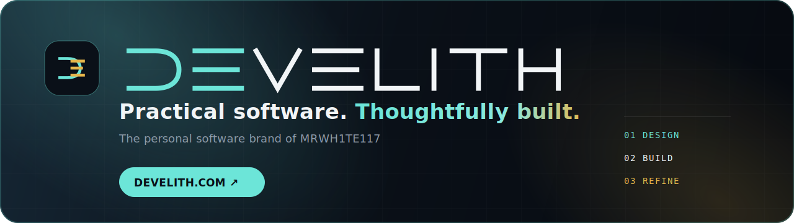

<!-- Profil README -->

  

<h1 align="center">Hi, I'm MRWH1TE117 👋</h1>

  <b>💻 IT Specialist</b> • <b>🧑‍💻 Frontend Developer</b> • <b>🛠️ Independent Software Maker</b> 
  Building practical applications at <a href="https://develith.com"><b>Develith</b></a> and dependable infrastructure behind them.

  
  

  
  
  

---

### ✦ Develith — my personal software brand

[Develith](https://develith.com) is the home for my focused, privacy-respecting applications. It brings together product thinking, frontend engineering and infrastructure experience under one visual identity and one quality bar: **practical software, thoughtfully built**.

The website presents current applications in English and Polish, with production releases available directly under the Develith domain.

### 🔧 Tech stack

| Frontend                                             | Backend/Scripts         | Infra/IT                                     |
| ---------------------------------------------------- | ----------------------- | -------------------------------------------- |
| TypeScript · JavaScript · Angular · React · HTML/CSS | PowerShell · Bash · Lua | VMware vSphere · Windows Server · AD · Veeam |

### 🚀 Featured Develith applications

#### 💍 Wedding Seating Planner

A bilingual, local-first wedding planner with a top-down 2D venue editor, exact chair assignments, spreadsheet import, local backups and print-ready PDF boards.

`TypeScript` · `React` · `Konva` · `IndexedDB`

#### 🎯 LifeQuest

A local-first personal development dashboard with goals, weekly planning, evidence-informed habits, daily micro-tasks, progress reports and safety-focused JSON backups.

`TypeScript` · `React` · `Vitest` · `IndexedDB`

Some larger personal tools and experiments remain private while they are being developed.

### 📌 Current focus

- Developing **Develith** as a consistent personal software brand and production home for present and future applications.
- Refining **Wedding Seating Planner** and **LifeQuest** through real usage, local-first data ownership and deliberate UI/UX improvements.
- Building reliable delivery workflows with automated tests, GitHub Actions, Hostido deployments, Cloudflare and production verification.
- Improving practical data workflows: validation, safe import/export, backups, local persistence and clear recovery paths.
- Combining frontend development with hands-on infrastructure experience across Windows Server, VMware and automation.

### 🤝 Contact / cooperation

I prefer Issues / Discussions on repositories. I will gladly accept PRs and bug reports with logs.

---
